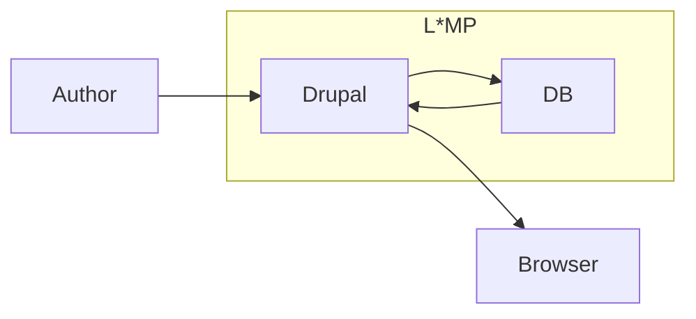
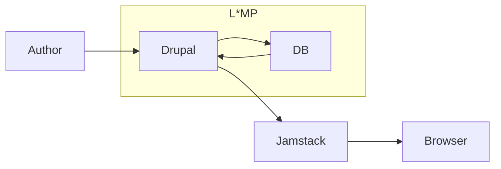
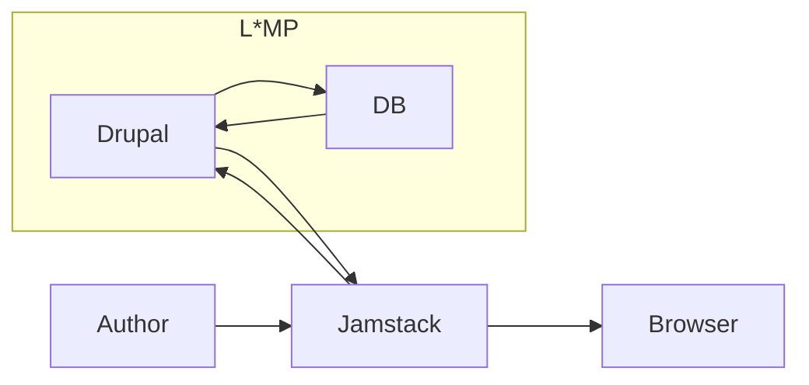
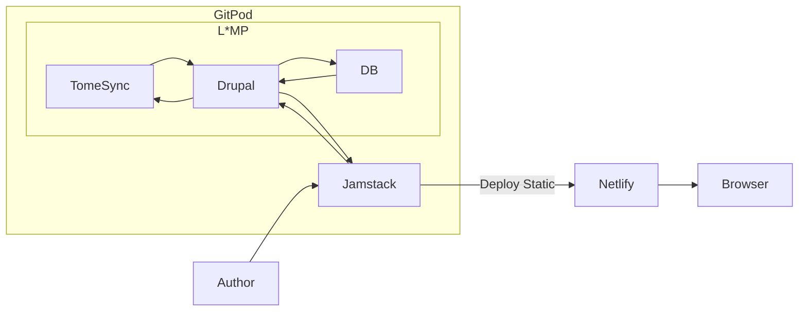

# Headless

And the Content Authoring Experience

[ds21-headless-axe.slides.realityloop.com](http://ds21-headless-axe.slides.realityloop.com/)

---
layout: image-right
image: https://s.gravatar.com/avatar/499831a65f45885a7e1b70ea47c06a58?s=800
src: ./slide-presenter-stuartclark.md
---

---
layout: image-left
image: https://www.drupal.org/files/21784549635_9618b3afe0_z.jpg
---

# Hello!
# We are Guests

- Brian Gilbert
- Jack Taranto
- Lee Rowlands
- Your name here*

\* Open Mic and Video encouraged

---
layout: section
---

# Table of Contents

1. Hello!
2. Drupal and Decoupled
3. The technology
4. Demos
5. Discussion

---
image: >-
  https://cdn.dribbble.com/users/9683/screenshots/12232498/media/26803da2823d3f5044b7902ba01dd450.png?compress=1&resize=1200x900
layout: image-right
position: right
---

# Traditional CMS
### = Drupal + L\*MP

- Content Authoring in Drupal
- Content Rendering in Drupal
- Content Storage in Drupal

<!--
Traditional CMS === Drupal

Brian Gilbert to talk to this?

Pros:
- Super powerful, can do anything you want it to do.
- Modules and Themes make it even more powerful: Paragraphs, Gin, etc.

Cons:
- Twig/PHP theming
- Complex content editing UI
-->

---
image: https://mateuaguilo.com/assets/images/drupal-embed.png
layout: image-left
position: right
---

# Progressively decoupled
### = Drupal + ??? + L*MP

- Content Authoring in Drupal
- Content Rendering in Drupal and JS
- Content Storage in Drupal

<!--
Jack Taranto to demo and talk to pros/cons.

Lullabot / Widgets: https://www.lullabot.com/articles/progressive-decoupling-made-easy
-->

---
image: https://site.druxtjs.org/assets/img/umami.fb2904b6.png
layout: image-right
position: left
---

# Fully decoupled
### = (Drupal + L*MP) + Jamstack

- Content Authoring in Drupal
- Content Rendering in Jamstack
- Content Storage in Drupal

<!--
Pros:
- Full control of the rendering technology; Vue, React, etc
- Ability to decouple authoring as well as rendering.
- Can take advantage of Frontend frameworks; Next, Nuxt, Druxt

Cons:
- Drupal skills not 100% transferable
-->

---
image: /images/headless-druxt.png
layout: image-left
---

# Headless
### = Fully Decoupled
### + Decoupled Authoring Experience

- Content Authoring in Jamstack
- Content Rendering in Jamstack
- Content Storage in Drupal

---
id: xQK03PqcNZ8
layout: youtube-right
---

# Serverless
### = (Fully Decoupled + Cloud IDE + Full Static)
### + Static hosting

- Content Authoring in Jamstack
- Content Rendering in Jamstack
- Content Storage in Drupal via Tome Sync

---
layout: section
---

# The Technology

---
layout: two-cols
image: https://site.druxtjs.org/assets/img/umami.fb2904b6.png
---

:: right ::
# DruxtJS

[DruxtJS.org](https://druxtjs.org)

+ Fully Decoupled Drupal
+ Server Side and Client Side Rendering
+ Static Site Generator
+ Vue.js/Nuxt.js

---
image: >-
  https://images.ctfassets.net/vkdbses00qqt/Dz58dBKd9TTfnQaIcau2F/9b7b94b3be605195a65e88633dbe9e79/gatsbyjs.com_Keyvisual_4-2021.jpg?w=960&h=1080&q=80
layout: image-right
---

# Gatsby

[Gatsbyjs.com](https://www.gatsbyjs.com/)

+ Static site builder
+ Pages created at build time
+ Rehydrates to a React app
+ Strong Drupal integration

<!--
- hard problems - editing context, preview, slow builds, large builds
- gatsby-plugin-drupal transforms Json:API responses to GraphQL, this is inhibiting if you're doing headless (use GraphQL instead)
-->

---
layout: two-cols
---

## Links

### This presentation

- Slides: [ds21-headless-axe.slides.realityloop.com](https://ds21-headless-axe.slides.realityloop.com/)
- GitPod: [gitpod.io#snapshot/03909c8e-fa76-49e5-9a5a-babe5239228b](https://gitpod.io#snapshot/03909c8e-fa76-49e5-9a5a-babe5239228b)

### Druxt

- Project / Docs: https://druxtjs.org
- GitHub: [github.com/druxt/druxt.js](https://github.com/druxt/druxt.js)
- Community: [discord.druxtjs.org](https://discord.druxtjs.org) / #druxt

### Gastby

- Project / Docs: [gatsbyjs.com](https://www.gatsbyjs.com/)
- Github: [github.com/gatsbyjs/gatsby](https://github.com/gatsbyjs/gatsby)

:: right ::

### Vue

- [vuejs.org](https://vuejs.org/)

### React

- [reactjs.org](https://reactjs.org/)

### Articles

- [lullabot.com/articles/progressive-decoupling-made-easy](https://lullabot.com/articles/progressive-decoupling-made-easy)

