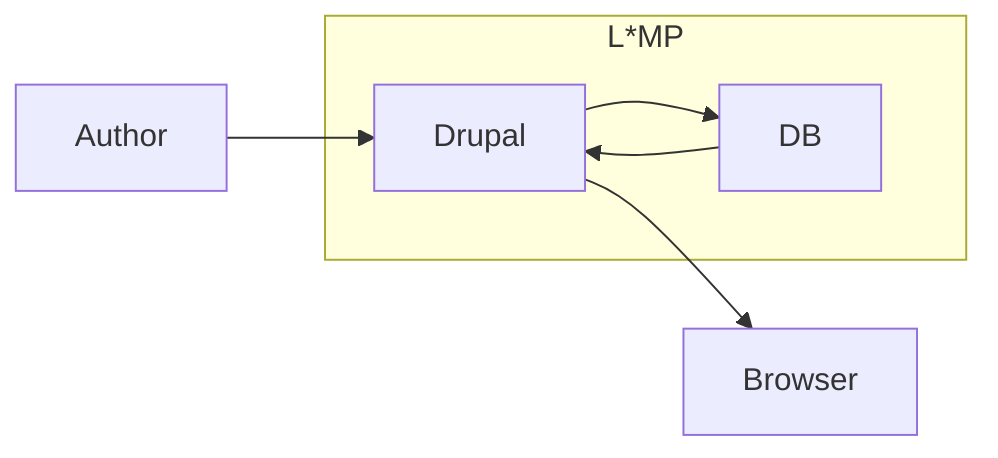
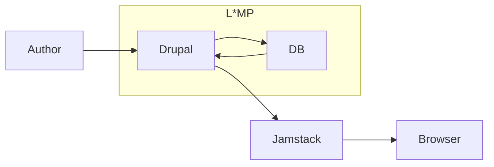
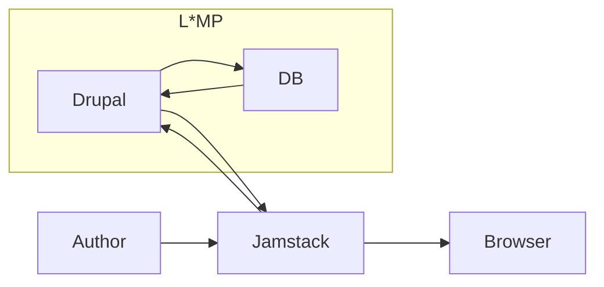
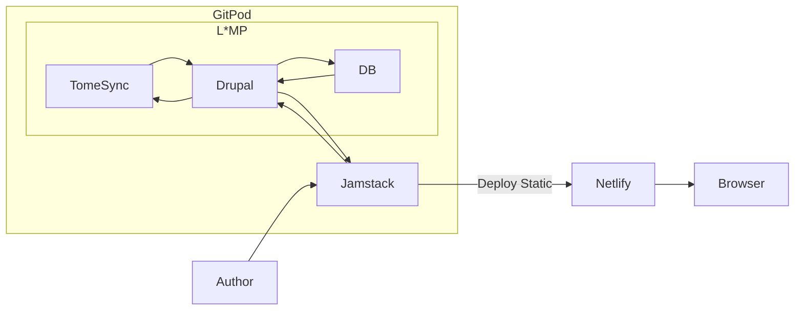

# Headless

And the Content Authoring Experience

---
layout: image-right
image: https://s.gravatar.com/avatar/499831a65f45885a7e1b70ea47c06a58?s=800
src: ./slide-presenter-stuartclark.md
---

---
layout: image-left
image: https://www.drupal.org/files/21784549635_9618b3afe0_z.jpg
---

# Hello!
# We are Guests

- Brian Gilbert
- Jack Taranto
- Lee Rowlands
- Your name here*

\* Open Mic and Video encouraged

---
layout: section
---

# Table of Contents

1. Hello!
2. Traditional CMS
3. Decoupled CMS
4. Headless CMS
5. Serverless CMS

---
image: >-
  https://cdn.dribbble.com/users/9683/screenshots/12232498/media/26803da2823d3f5044b7902ba01dd450.png?compress=1&resize=1200x900
layout: image-right
position: right
---

# Traditional CMS
### = Drupal + L\*MP

- Content Authoring in Drupal
- Content Rendering in Drupal
- Content Storage in Drupal

<!--
Brian Gilbert to talk to this?
Paragraphs, Gin, etc.
-->

---
image: https://mateuaguilo.com/assets/images/drupal-embed.png
layout: image-left
position: right
---

# Progressively decoupled
### = Drupal + ??? + L*MP

- Content Authoring in Drupal
- Content Rendering in Drupal
- Content Storage in Drupal

<!--
Jack Taranto to demo and talk to pros/cons.
-->

---
image: https://site.druxtjs.org/assets/img/umami.fb2904b6.png
layout: image-right
position: left
---

# Fully decoupled
### = (Drupal + L*MP) + Jamstack

- Content Authoring in Drupal
- Content Rendering in Jamstack
- Content Storage in Drupal

<!--
Stuart / Lee to talk to.
-->

---
layout: two-cols
---

:: right ::
# DruxtJS

[DruxtJS.org](https://druxtjs.org)

+ Fully Decoupled
+ Server Side and Client Side Rendering
+ Static Site Generator
+ Vue.js/Nuxt.js

---
image: >-
  https://images.ctfassets.net/vkdbses00qqt/Dz58dBKd9TTfnQaIcau2F/9b7b94b3be605195a65e88633dbe9e79/gatsbyjs.com_Keyvisual_4-2021.jpg?w=960&h=1080&q=80
layout: image-right
---

# Gatsby

[Gatsbyjs.com](https://www.gatsbyjs.com/)

+
+
+
+

---
layout: image-left
---

# Headless
### = Fully Decoupled
### + Decoupled Authoring Experience

- Content Authoring in Jamstack
- Content Rendering in Jamstack
- Content Storage in Drupal

---
layout: two-cols
---

# Serverless
### = (Fully Decoupled + Cloud IDE + Full Static)
### + Static hosting

- Content Authoring in Jamstack
- Content Rendering in Jamstack
- Content Storage in Drupal via Tome Sync

:: right ::

